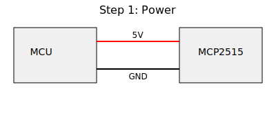
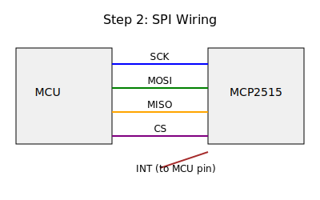
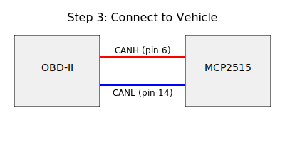

# obd

## Pin Mapping and Power Requirements

Common MCP2515 CAN controller modules use SPI to interface with microcontrollers.
The table below shows typical connections when using an Arduino Uno. Adapt as needed
for your platform.

| MCP2515 Pin | Arduino Uno Pin | Notes |
|-------------|-----------------|------|
| VCC         | 5V              | Some modules have onboard 3.3 V regulator. Use 3.3 V modules directly. |
| GND         | GND             | Common ground between boards. |
| CS          | D10             | Chip select for SPI. |
| SCK         | D13             | SPI clock. |
| SI (MOSI)   | D11             | Master out, slave in. |
| SO (MISO)   | D12             | Master in, slave out. |
| INT         | D2 (optional)   | Interrupt pin used for message alerts. |
| CANH        | OBD-II pin 6    | Connect to the vehicle’s CAN high line. |
| CANL        | OBD-II pin 14   | Connect to the vehicle’s CAN low line. |

**Power:** Most MCP2515 boards require 5 V and draw around 60–70 mA.
If your board is 3.3 V only, ensure the MCU's logic levels are compatible
or use level shifting. Never feed 12 V from the vehicle directly into the board.

## Disclaimers

- Working on vehicle networks can void your manufacturer warranty.
- Ensure the vehicle is secured and follow standard electrical safety practices.
- Check local laws; accessing or modifying in-vehicle networks may be restricted.

## MCP2515 Wiring Diagrams

These diagrams illustrate a typical wiring sequence for a common MCP2515 module.

### Step 1 – Power

### Step 2 – SPI Wiring

### Step 3 – Connect to Vehicle

