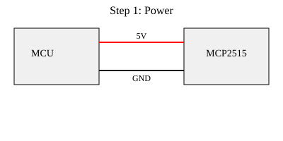
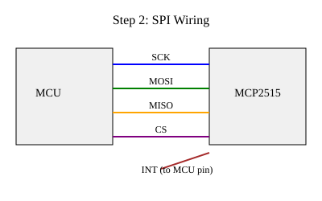
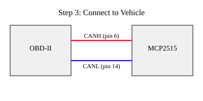

# obd


## Pin Mapping and Power Requirements

Common MCP2515 CAN controller modules use SPI to interface with microcontrollers.
The table below shows typical connections when using an Arduino Uno. Adapt as needed
for your platform.

| MCP2515 Pin | Arduino Uno Pin | Notes |
|-------------|-----------------|------|
| VCC         | 5V              | Some modules have onboard 3.3 V regulator. Use 3.3 V modules directly. |
| GND         | GND             | Common ground between boards. |
| CS          | D10             | Chip select for SPI. |
| SCK         | D13             | SPI clock. |
| SI (MOSI)   | D11             | Master out, slave in. |
| SO (MISO)   | D12             | Master in, slave out. |
| INT         | D2 (optional)   | Interrupt pin used for message alerts. |
| CANH        | OBD-II pin 6    | Connect to the vehicle’s CAN high line. |
| CANL        | OBD-II pin 14   | Connect to the vehicle’s CAN low line. |

**Power:** Most MCP2515 boards require 5 V and draw around 60–70 mA.
If your board is 3.3 V only, ensure the MCU's logic levels are compatible
or use level shifting. Never feed 12 V from the vehicle directly into the board.

## Disclaimers

- Working on vehicle networks can void your manufacturer warranty.
- Ensure the vehicle is secured and follow standard electrical safety practices.
- Check local laws; accessing or modifying in-vehicle networks may be restricted.

## MCP2515 Wiring Diagrams

These diagrams illustrate a typical wiring sequence for a common MCP2515 module.

### Step 1 – Power



### Step 2 – SPI Wiring



### Step 3 – Connect to Vehicle



## Dependencies

The utilities and tests rely on a few Python packages:

- [`python-can`](https://python-can.readthedocs.io/)
- [`cantools`](https://cantools.readthedocs.io/)
- [`paho-mqtt`](https://www.eclipse.org/paho/)
- [`opendbc`](https://github.com/commaai/opendbc) – optional, used as a fallback set of community DBC files

Install them with `pip install -r requirements.txt`.

## Privilege Requirements

Configuring a SocketCAN interface requires root privileges or the
`CAP_NET_ADMIN` capability. To grant the capability to the Python
interpreter without running as root:

```bash
sudo setcap cap_net_admin+ep $(readlink -f $(which python3))
```

If the bundled `OBD.dbc` cannot be loaded, the CAN monitor will
automatically fall back to the community DBC files provided by
[`opendbc`](https://github.com/commaai/opendbc).

## Usage Guide

For step-by-step setup, configuration, and troubleshooting instructions, see
the [getting started guide](docs/GETTING_STARTED.md).

## BLF Log Decoding

A small helper script, `blf_decoder.py`, can decode Vector BLF log files
using the bundled `OBD.dbc` database:

```bash
python -m blf_decoder PV11-yadwad_0004465_20250102_012231.blf
```

Pass `--dbc` to supply an alternative DBC file.  Each decoded frame is
printed as `id`, raw hex payload and the parsed signal dictionary.

## UDS Integration

The CAN monitor can interpret Unified Diagnostic Services (UDS) responses
when provided with an `uds` section in the JSON configuration passed via
`--config`.  The section defines CAN IDs for requests and responses,
diagnostic trouble code (DTC) metadata and ISO-TP flow control options.

```json
{
  "uds": {
    "ecu_request_id": 2016,
    "ecu_response_id": 2024,
    "security": {
      "level": 1,
      "key": "FFFF",
      "algorithm": "xor"
    },
    "dtcs": {
      "P20F9": {
        "description": "Power stack motor over-temperature (>100°C)",
        "severity": "CRITICAL",
        "alert": true,
        "component": "PS"
      }
    },
    "flow_control": {"block_size": 0, "st_min_ms": 0}
  }
}
```

The security `key` may also be supplied as a list of byte values:

```json
"security": {"level": 1, "key": [255, 255]}
```

The `algorithm` field is optional and allows selecting an OEM-specific
key derivation method.

Multi-frame UDS responses are reassembled automatically.  When DTC
information (service `0x19`) is received, entries found in `uds.dtcs`
are logged with their description and severity, and any critical codes
emit an alert in the log output.

A sample configuration is bundled as `uds_config.json` for quick access.

The low level ``UDSClient`` helper used by the monitor also exposes a
configurable timeout.  The ``timeout`` argument of ``send`` and ``request`` may
be either a single float or a ``(N_Bs, N_Cr)`` tuple to independently limit how
long the client waits for Flow Control frames and for response data.

### Debug Logging

``UDSClient`` emits detailed debug logs for ISO-TP segmentation. Pass a custom
logger to its constructor to control logging output:

```python
import logging

log = logging.getLogger("uds")
log.setLevel(logging.DEBUG)
client = UDSClient(bus, 0x7E0, 0x7E8, logger=log)
```

Key events like frame segmentation, Flow Control waits and errors are logged at
the ``DEBUG`` level.

### Advanced Options

#### Configuration and Timeouts

- ``max_rx_size`` limits the number of bytes reassembled for a multi-frame
  response.  Responses exceeding this size raise an ``ISOTransportError``.
- The ``timeout`` argument of :meth:`send`, :meth:`receive`, and
  :meth:`request` accepts either a single float or a ``(flow_control,
  response)`` tuple.  The first element (``N_Bs``) bounds how long the client
  waits for a Flow Control frame after transmitting a First Frame.  The second
  element (``N_Cr``) limits the wait for each consecutive response frame.
- Flow Control frames with status **WAIT** pause transmission but do not reset
  ``N_Bs``.  If the timeout expires while waiting, ``ISOTransportError`` is
  raised.  A status of **Overflow** triggers the same error immediately.

#### Thread Safety

``UDSClient`` serializes calls using an internal ``threading.Lock`` and is not
safe for concurrent use.  Invoking ``send``, ``receive`` or ``request`` from
multiple threads at the same time raises ``RuntimeError``.  External
serialization is required when sharing a client instance.

#### Extended Addressing

Normal-fixed, mixed and extended addressing modes are supported:

- Supplying ``source_address`` and ``target_address`` automatically derives
  29-bit identifiers using the ISO-TP normal-fixed scheme.
- ``address_extension`` prepends an additional address byte for extended or
  mixed addressing.

#### Flow Control Tuning

The block size and minimum separation time advertised in Flow Control frames can
be adjusted to trade throughput for bus load or apply throttling.

```python
# Maximise throughput
client = UDSClient(bus, 0x7E0, 0x7E8, rx_block_size=0, rx_st_min=0)

# Throttle to one frame at a time with 20 ms between frames
client = UDSClient(bus, 0x7E0, 0x7E8, rx_block_size=1, rx_st_min=20)

# Protect against oversized responses
client = UDSClient(bus, 0x7E0, 0x7E8, max_rx_size=1024)

# Permit a single Flow Control WAIT before aborting
client = UDSClient(bus, 0x7E0, 0x7E8, wft_max=1)
```

Equivalent settings may be supplied in the JSON configuration:

```json
"uds": {
  "ecu_request_id": 2016,
  "ecu_response_id": 2024,
  "flow_control": {"block_size": 1, "st_min_ms": 20}
}
```
